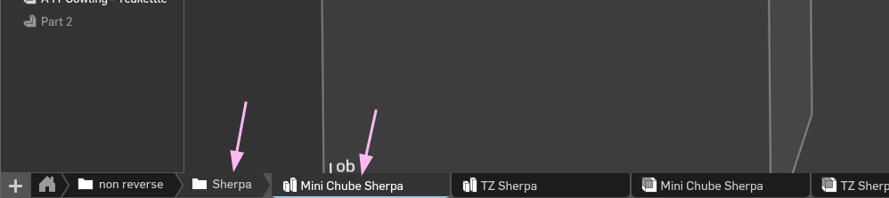
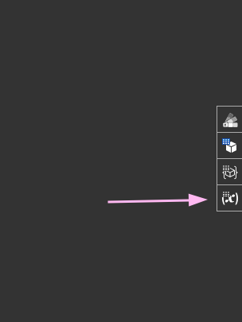
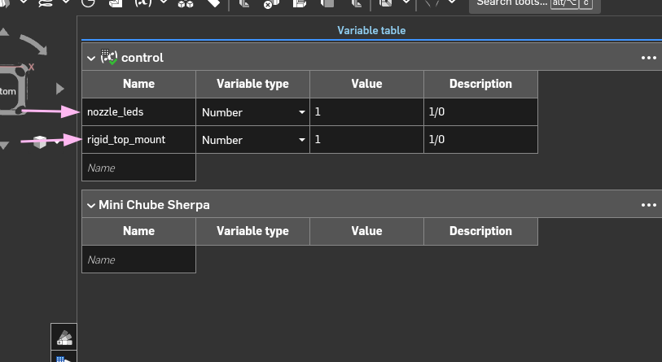

# CAD

Step files will be uploaded later if at all.

The OnShape doc can be found here, along with a configfurator for some of the features: [A5T](https://cad.onshape.com/documents/88e814f74db3cf7c788841a0/w/b7cedbaf9f75df3107ffd0e8/e/869c7e79857579af029e49ef?renderMode=0&uiState=694f0fcba82222f583caf4cb).

## Configurator Controls

Open the part studio for your needed model

Click variable studio

Change variable values. Possible values are in `Description`

