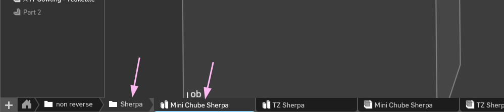
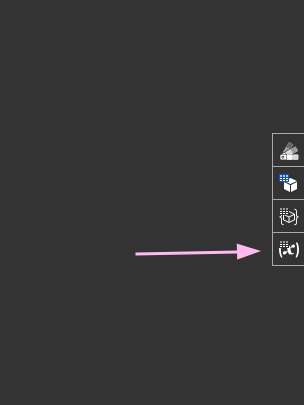
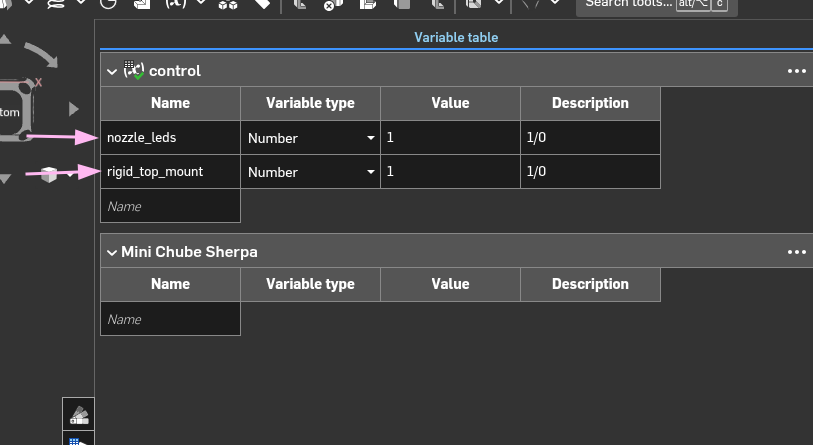

# Configurator

Some common STLs are already provided in the `STL` folder.

The configurator for A5T is OnShape. It has a flexible variable system and easy controls.

https://cad.onshape.com/documents/88e814f74db3cf7c788841a0/w/b7cedbaf9f75df3107ffd0e8/e/869c7e79857579af029e49ef?renderMode=0&uiState=694f0fcba82222f583caf4cb

## Configurator Controls

Open the part studio for your needed model

___

Click variable studio

___

Change variable values. Possible values are in `Description`. Explanation for the variables are in [./STL/Cowlings/README.md](./STL/Cowlings/README.md).

