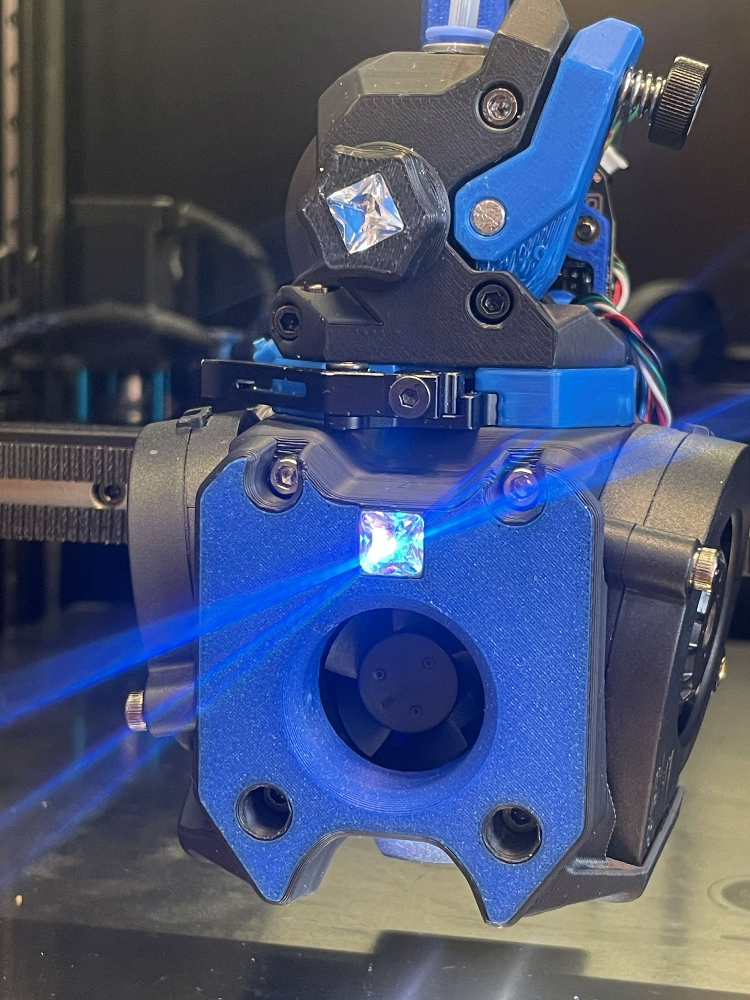
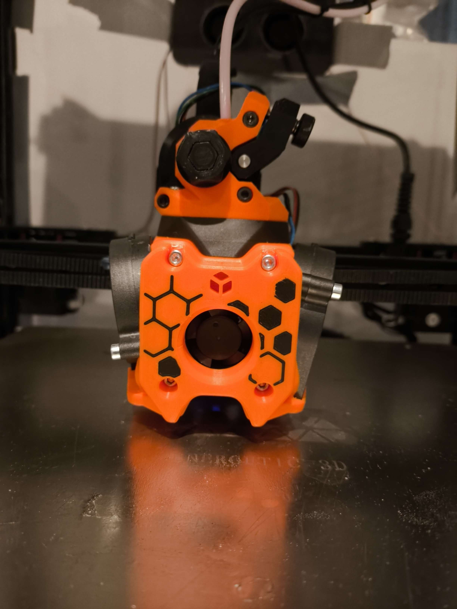

First image of A5T. Notice the TZv6, which was the hotend we had available for testing. Whiskers strapped an 80w heater to it (don't try this at home) because otherwise the 5015s would overpower the stock heater.

___
First documented printed prototype of A5T, done by myself (suzuki), never used.

___
Whiskers' A5T with the sapphire/rainbow barf diffuser. Notice the Crossbow cutter.

___
Shante's A5T for revo voron. The hexagons are done through the slicer.

___