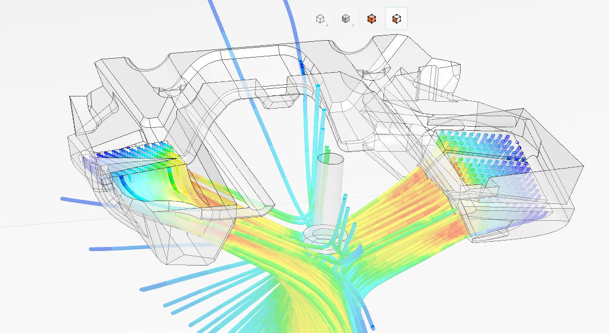
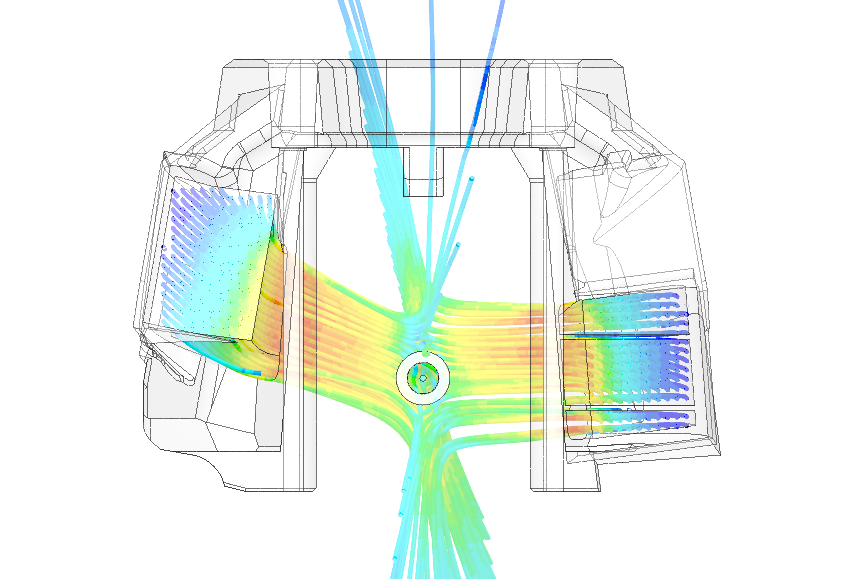
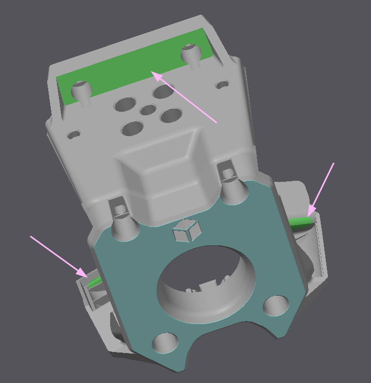

# A5T

+ Credit goes to Sir DW Tas, who provided the original A4T and helped us with figuring out simulations.

[Simulations](https://www.simscale.com/projects/suzu_00071/a5t_test/).
___

We officially support *only* Chube Compact, but I did make some cowls for other hotends. To keep the repository clean I didn't add them here. If you have any requests for cowlings feel free to contact me through Discord (@suzu00071 or WKSuzuki server) or through email (suzuki00071@gmail.com).
___

## Usage
A5T takes away about 7.5mm of X travel from each side. You will also need a custom endstop. If using sensorless, you can unscrew the rail screw and use it as the endstop (check that it wont rattle out when printing).

Using fridge/clicky door we haven't had any Y travel taken. We have not checked A5T with the stock door.

> [!WARNING]
> + A5T is not an easy print.
> + The intended carriage for A5T is Vitalii's milled StealthBurner or A4T carriage. **It will not fit on the standard carriage**.
>   + If using Vitalii's milled SB carriage, use the CW2 version.

> [!NOTE]
> + Use paint on supports for the duct enterances. If using Sherpa, also add support to the top shelf. (see image)
>
> 
>
> + Apart from the cowling and the logo led, everything is stock and can be taken from the [A4T repository](https://github.com/Armchair-Heavy-Industries/A4T/tree/main).
___

This work is licensed under <a href="https://creativecommons.org/licenses/by-nc-sa/4.0/">CC BY-NC-SA 4.0</a>

<a href="https://ko-fi.com/suzuki00071">
